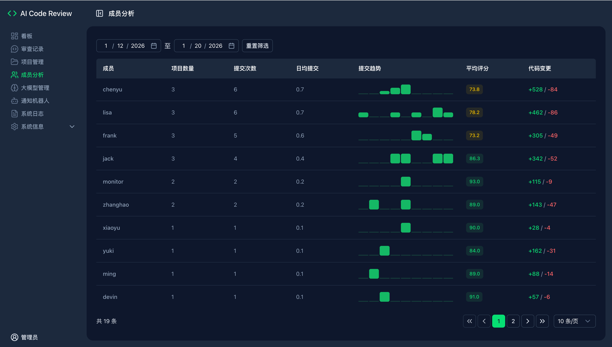

## 项目简介

本项目是一个基于大模型的自动化代码审查工具，帮助开发团队在代码合并或提交时，快速进行智能化的审查(Code Review)，提升代码质量和开发效率。

## 功能

- 🚀 多模型支持
  - 兼容 DeepSeek、ZhipuAI、OpenAI、Anthropic、通义千问 和 Ollama，想用哪个就用哪个。
- 📢 消息即时推送
  - 审查结果一键直达 钉钉、企业微信 或 飞书，代码问题无处可藏！
- 📅 自动化日报生成
  - 基于 GitLab & GitHub & Gitea Commit 记录，自动整理每日开发进展，谁在摸鱼、谁在卷，一目了然 😼。
- 📊 可视化 Dashboard
  - 集中展示所有 Code Review 记录，项目统计、开发者统计，数据说话，甩锅无门！
- 🎭 Review Style 任你选
  - 专业型 🤵：严谨细致，正式专业。 
  - 讽刺型 😈：毒舌吐槽，专治不服（"这代码是用脚写的吗？"） 
  - 绅士型 🌸：温柔建议，如沐春风（"或许这里可以再优化一下呢~"） 
  - 幽默型 🤪：搞笑点评，快乐改码（"这段 if-else 比我的相亲经历还曲折！"）

**效果图:**


## 原理

当用户在 GitLab 上提交代码（如 Merge Request 或 Push 操作）时，GitLab 将自动触发 webhook
事件，调用本系统的接口。系统随后通过第三方大模型对代码进行审查，并将审查结果直接反馈到对应的 Merge Request 或 Commit 的
Note 中，便于团队查看和处理。


## 部署

### 方案一：Docker 部署

**1. 准备环境文件**

- 克隆项目仓库：
```aiignore
git clone https://github.com/sunmh207/AI-Codereview-Gitlab.git
cd AI-Codereview-Gitlab
```

- 创建配置文件：
```aiignore
cp conf/.env.dist conf/.env
```

- 编辑 conf/.env 文件，配置以下关键参数：

```bash
#大模型供应商配置,支持 zhipuai , openai , deepseek 和 ollama
LLM_PROVIDER=deepseek

#DeepSeek
DEEPSEEK_API_KEY={YOUR_DEEPSEEK_API_KEY}

#支持review的文件类型(未配置的文件类型不会被审查)
SUPPORTED_EXTENSIONS=.java,.py,.php,.yml,.vue,.go,.c,.cpp,.h,.js,.css,.md,.sql

#钉钉消息推送: 0不发送钉钉消息,1发送钉钉消息
DINGTALK_ENABLED=0
DINGTALK_WEBHOOK_URL={YOUR_WDINGTALK_WEBHOOK_URL}

#Gitlab配置
GITLAB_ACCESS_TOKEN={YOUR_GITLAB_ACCESS_TOKEN}
```

**2. 启动服务**

```bash
docker-compose up -d
```

**3. 验证部署**

- 主服务验证：
  - 访问 http://your-server-ip:5001
  - 显示 "The code review server is running." 说明服务启动成功。
- Dashboard 验证：
  - 访问 http://your-server-ip:5002
  - 看到一个审查日志页面，说明 Dashboard 启动成功。

### 方案二：本地Python环境部署

**1. 获取源码**

```bash
git clone https://github.com/sunmh207/AI-Codereview-Gitlab.git
cd AI-Codereview-Gitlab
```

**2. 安装依赖**

使用 Python 环境（建议使用虚拟环境 venv）安装项目依赖(Python 版本：3.10+):

```bash
pip install -r requirements.txt
```

**3. 配置环境变量**

同 Docker 部署方案中的.env 文件配置。

**4. 启动服务**

- 启动API服务：

```bash
python api.py
```

- 启动Dashboard服务：

```bash
streamlit run ui.py --server.port=5002 --server.address=0.0.0.0
```

### 配置 GitLab Webhook

#### 1. 创建Access Token

方法一：在 GitLab 个人设置中，创建一个 Personal Access Token。

方法二：在 GitLab 项目设置中，创建Project Access Token

#### 2. 配置 Webhook

在 GitLab 项目设置中，配置 Webhook：

- URL：http://your-server-ip:5001/review/webhook
- Trigger Events：勾选 Push Events 和 Merge Request Events (不要勾选其它Event)
- Secret Token：上面配置的 Access Token(可选)

**备注**

1. Token使用优先级
  - 系统优先使用 .env 文件中的 GITLAB_ACCESS_TOKEN。
  - 如果 .env 文件中没有配置 GITLAB_ACCESS_TOKEN，则使用 Webhook 传递的Secret Token。
2. 网络访问要求
  - 请确保 GitLab 能够访问本系统。
  - 若内网环境受限，建议将系统部署在外网服务器上。

### 配置 Gitea Webhook

#### 1. 创建 Access Token
- 在 Gitea 个人设置中创建 Access Token，并确保具备 `repo` 权限。

#### 2. 配置 Webhook
- 打开仓库 `Settings -> Webhooks -> Add Webhook`
- URL：`http://your-server-ip:5001/review/webhook`
- Header：`X-Gitea-Token` 设置为 `.env` 中的 `GITEA_ACCESS_TOKEN`（可选）
- 触发事件：勾选 `Push events` 与 `Pull Request events`
- Content Type：`application/json`

### 配置消息推送

#### 1.配置钉钉推送

- 在钉钉群中添加一个自定义机器人，获取 Webhook URL。
- 更新 .env 中的配置：
  ```
  #钉钉配置
  DINGTALK_ENABLED=1  #0不发送钉钉消息，1发送钉钉消息
  DINGTALK_WEBHOOK_URL=https://oapi.dingtalk.com/robot/send?access_token=xxx #替换为你的Webhook URL
  ```

企业微信和飞书推送配置类似，具体参见 [常见问题](doc/faq.md)

## 常见问题

**1.如何对整个代码库进行Review?**

可以通过命令行工具对整个代码库进行审查。当前功能仍在不断完善中，欢迎试用并反馈宝贵意见！具体操作如下：

```bash
python -m biz.cmd.review
```

运行后，请按照命令行中的提示进行操作即可。

**2.其它常见问题**

参见 [常见问题](doc/faq.md)

### Code Review Pro 版

功能更丰富的 AI Code Review 版本

体验站: [https://demo.mzfuture.com](https://demo.mzfuture.com)

安装说明 [Code Review Pro 版](doc/pro.md)




## 交流

若本项目对您有帮助，欢迎 Star ⭐️ 或 Fork。 有任何问题或建议，欢迎提交 Issue 或 PR。

也欢迎加微信/微信群，一起交流学习。

<p float="left">
  
   
</p>

## Star History

[](https://www.star-history.com/#sunmh207/AI-Codereview-Gitlab&Timeline)